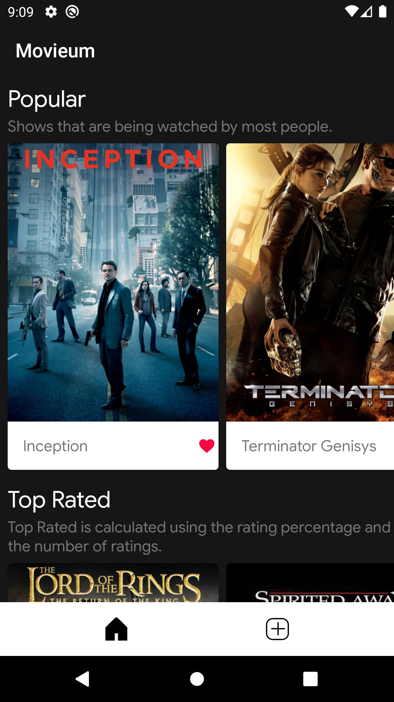
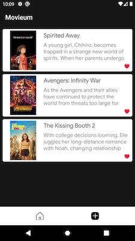

## Movieum 🎬

## Version 1.0

 

## About
Movieum simply loads popular movies from [The Movie DB Api](https://developers.themoviedb.org/4/getting-started/authorization) and stores your favorite movies in persistence storage (i.e [Room](https://developer.android.com/reference/android/arch/persistence/room/RoomDatabase)).

## Features
- Discover the most popular and top rated movies
- Marks your favorite movies

## Built With 👷‍

Movieum attempts to make use of the latest Android libraries and best practices:

- Entirely written in [Kotlin](https://kotlinlang.org/) official programming language for Android development
- [Coroutines](https://kotlinlang.org/docs/reference/coroutines-overview.html) for asynchronous programming and more
- [Flow](https://kotlinlang.org/docs/reference/coroutines/flow.html#asynchronous-flow) for asynchronous operations
- Use of [Android Jetpack](https://developer.android.com/jetpack) including:
  - [Architecture Components](https://developer.android.com/topic/libraries/architecture) including **ViewModel**, **LiveData**, **Room**, **DataBinding**, **Android KTK**
- [Retrofit/OKHttp](https://square.github.io/retrofit/) A type-safe HTTP client for Android
- [Hilt](https://dagger.dev/hilt/) for Dependecy Injection **Hilt-Dagger**, **Hilt-ViewModel**
- [Gson](https://github.com/google/gson) Gson is a Java library that can be used to convert Java Objects into their JSON representation.
- [Android Materiel Design](https://material.io/develop/android) Build beautiful, usable products using Material Components for Android
- [Stecho](http://facebook.github.io/stetho/) Stetho is a sophisticated debug bridge for Android applications.
- [Glide](https://github.com/bumptech/glide) supports fetching, decoding, and displaying video stills, images, and animated GIFs.
- Firebase Crashlytics 
## Architecture
Movieum uses **MVVM** with **Android Architecture Components (Room, LiveData, ViewModel)**

## License

